# Entity Resolution System - Architecture Diagrams

## System Architecture Overview

```mermaid
graph TB
    subgraph Input["🔵 INPUT LAYER"]
        A[Block Input<br/>Size-bounded records]
    end
    
    subgraph Feature["🟢 FEATURE LAYER"]
        B[Feature Extraction<br/>Text, Numeric, Categorical, Embeddings]
    end
    
    subgraph Similarity["🟡 SIMILARITY LAYER"]
        C[Pairwise Similarity<br/>Multi-dimensional vectors]
    end
    
    subgraph Graph["🟠 GRAPH CONSTRUCTION"]
        D[Initial Graph<br/>Nodes=Records, Edges=Candidates]
        E[Constraint Engine<br/>Hard & Soft Constraints]
        F[Graph Pruning<br/>Top-K, Normalization]
    end
    
    subgraph Seed["🔴 SEED LAYER"]
        G[Seed Clusters<br/>High-precision anchors]
    end
    
    subgraph Embedding["🟣 EMBEDDING LAYER"]
        H[Graph Embeddings<br/>FastRP / Node2Vec]
        I[Embedding Refinement<br/>α × original + β × embedding]
    end
    
    subgraph Clustering["🟤 CLUSTERING LAYER"]
        J[Community Detection<br/>Leiden / Louvain]
        K[Cluster Validation<br/>Entropy, Conflicts, Density]
        L[Cluster Repair<br/>Split, Remove, Reassign]
    end
    
    subgraph Output["🔵 OUTPUT LAYER"]
        M[Entity Assignment<br/>Confidence + Explanations]
    end
    
    A --> B
    B --> C
    C --> D
    D --> E
    E --> F
    F --> G
    G --> H
    H --> I
    I --> J
    J --> K
    K --> L
    L --> M
    
    style A fill:#4A90E2
    style B fill:#7ED321
    style C fill:#F5A623
    style D fill:#FF6B6B
    style E fill:#FF6B6B
    style F fill:#FF6B6B
    style G fill:#D0021B
    style H fill:#9013FE
    style I fill:#9013FE
    style J fill:#8B572A
    style K fill:#8B572A
    style L fill:#8B572A
    style M fill:#4A90E2
```

---

## Module Dependency Graph

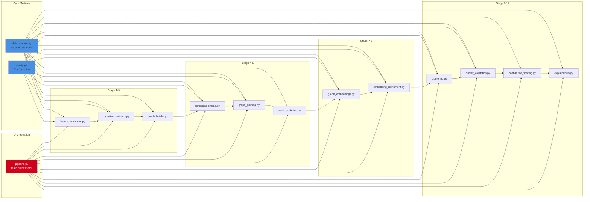

---

## Data Flow with Size Changes

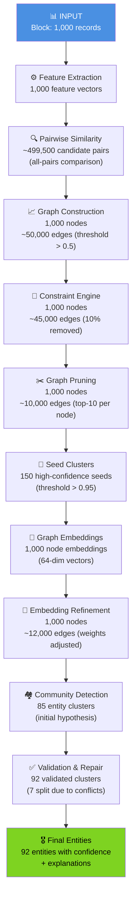

---

## Constraint Engine Decision Flow

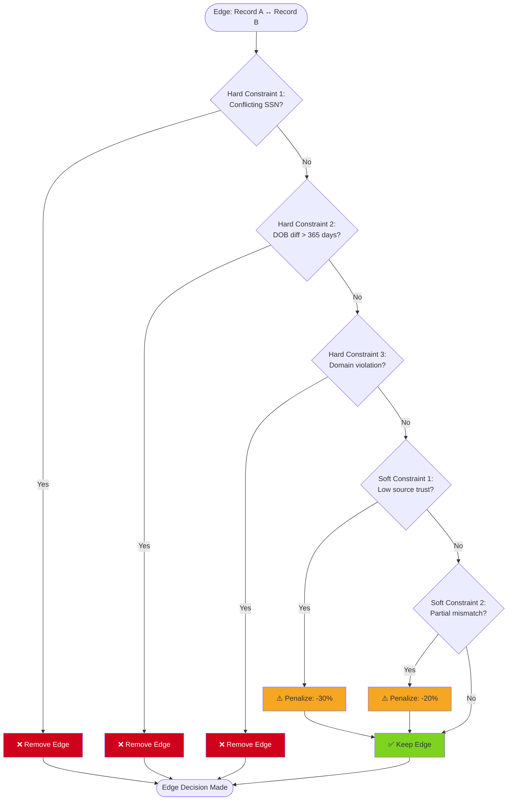

---

## Embedding Refinement Strategy

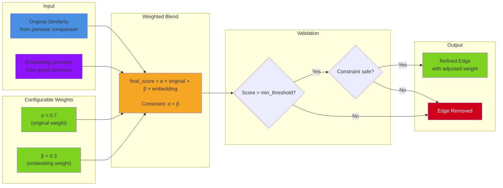

---

## Cluster Validation & Repair Flow

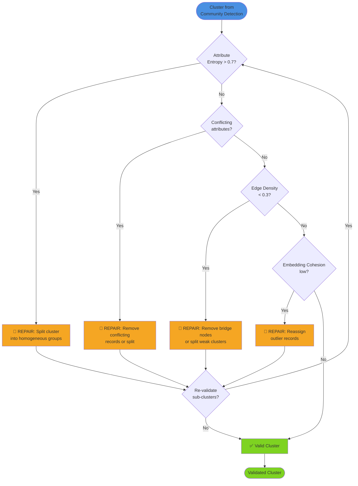

---

## Entity Confidence Scoring Components

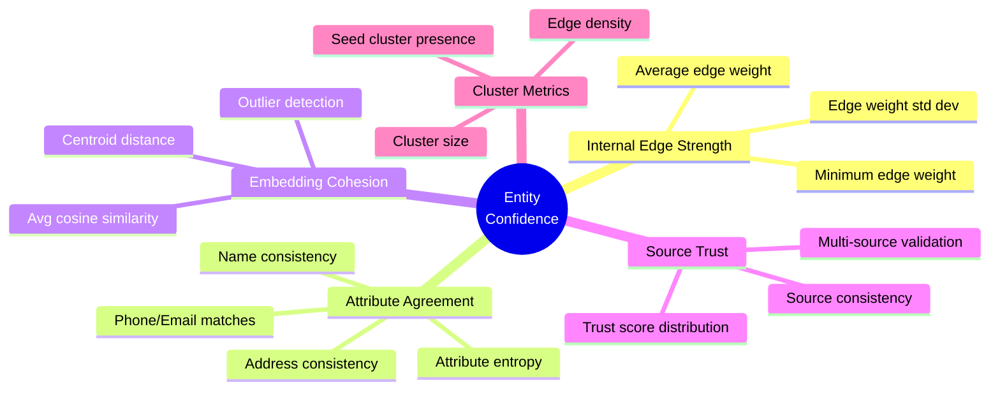

---

## Production Monitoring Dashboard Structure

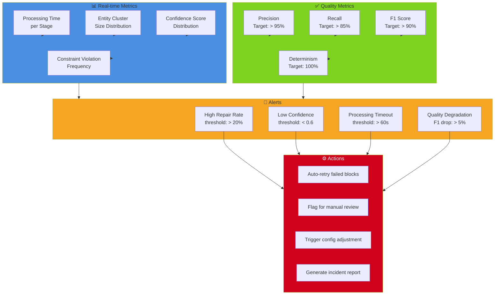

---

## Explanation Generation Architecture

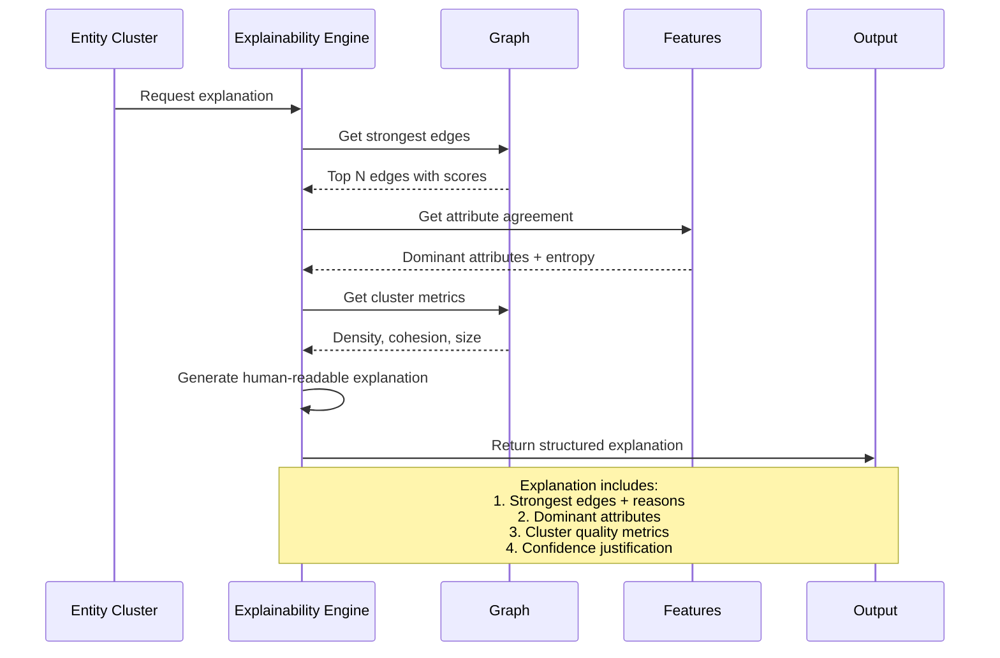

---

## Technology Stack Integration

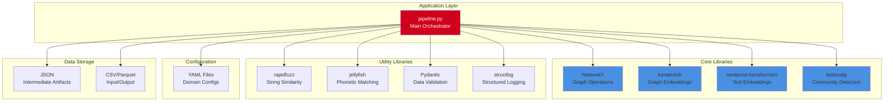

---

## Scalability Architecture for Production

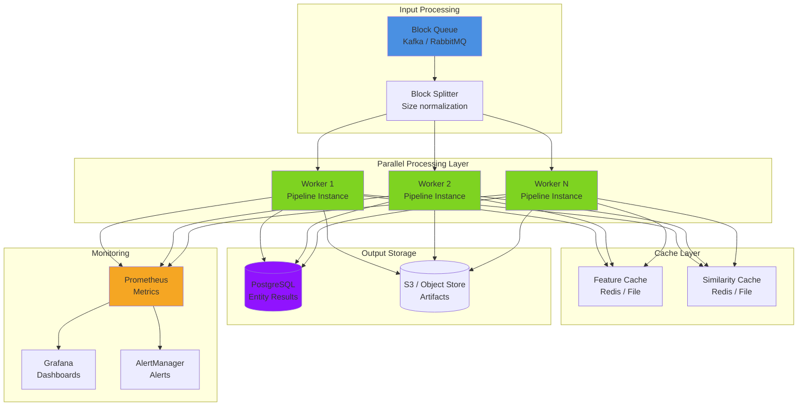

---

These diagrams provide a comprehensive visual representation of the entity resolution system architecture, covering data flow, module dependencies, decision logic, and production deployment considerations.
